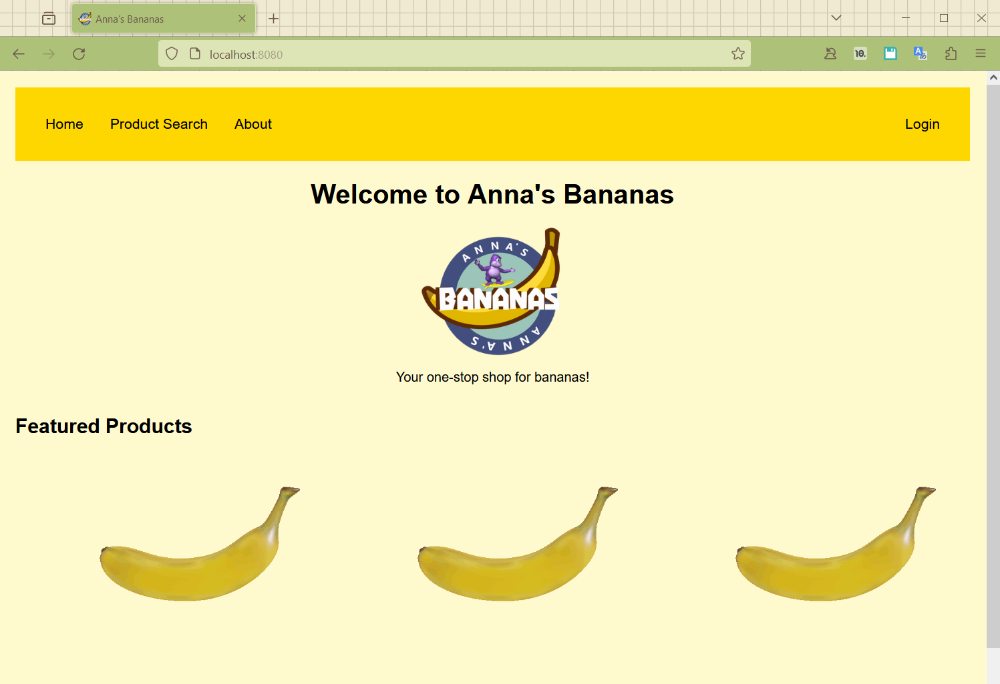
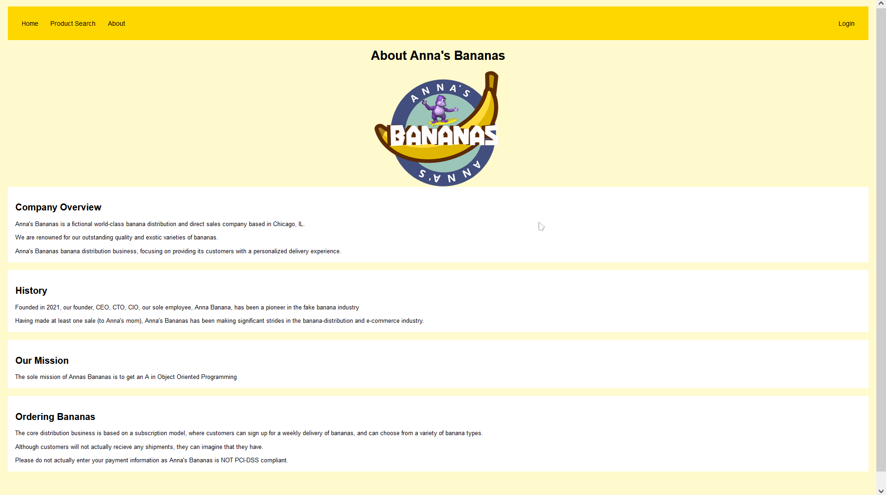
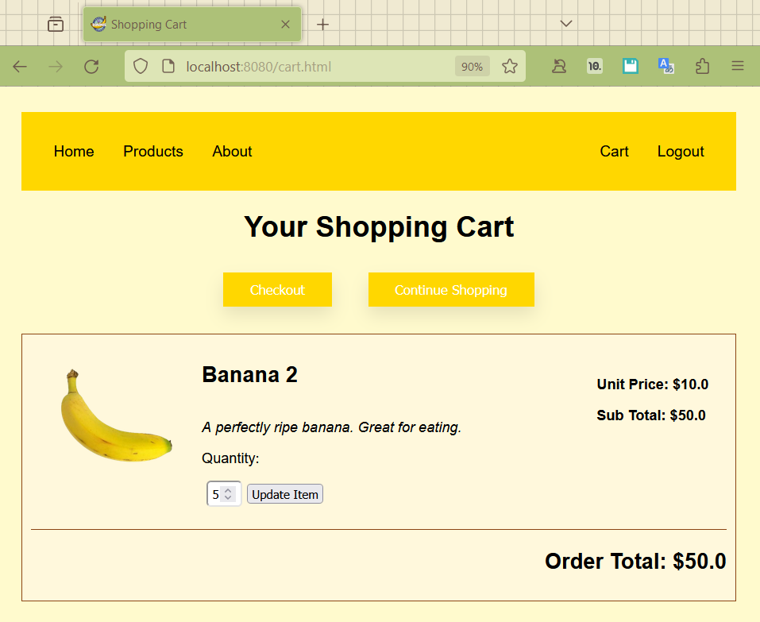
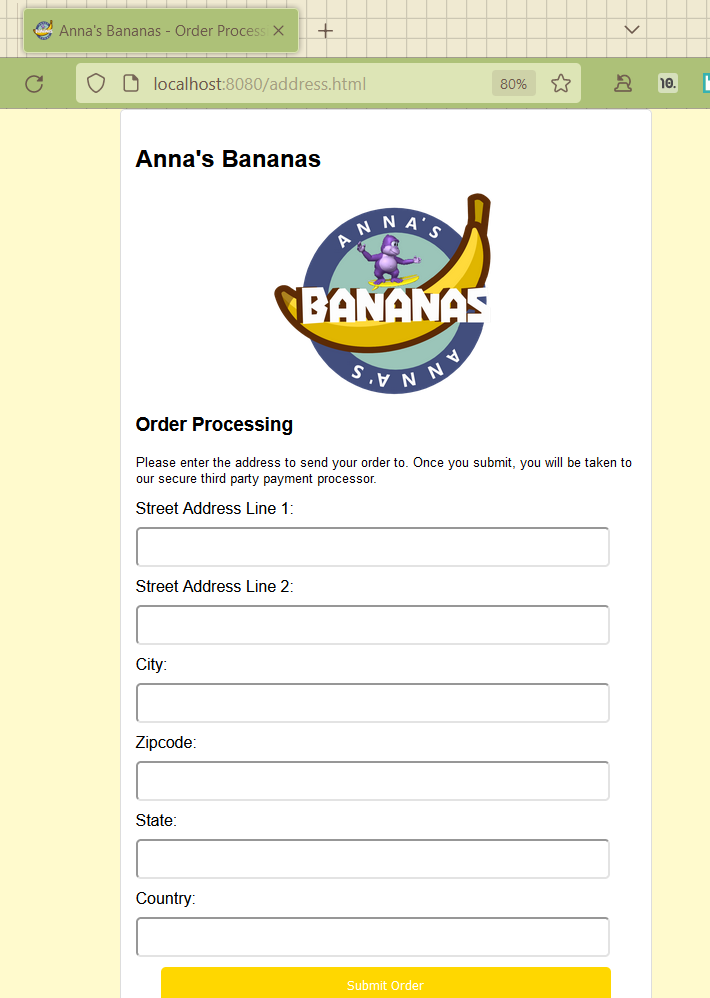
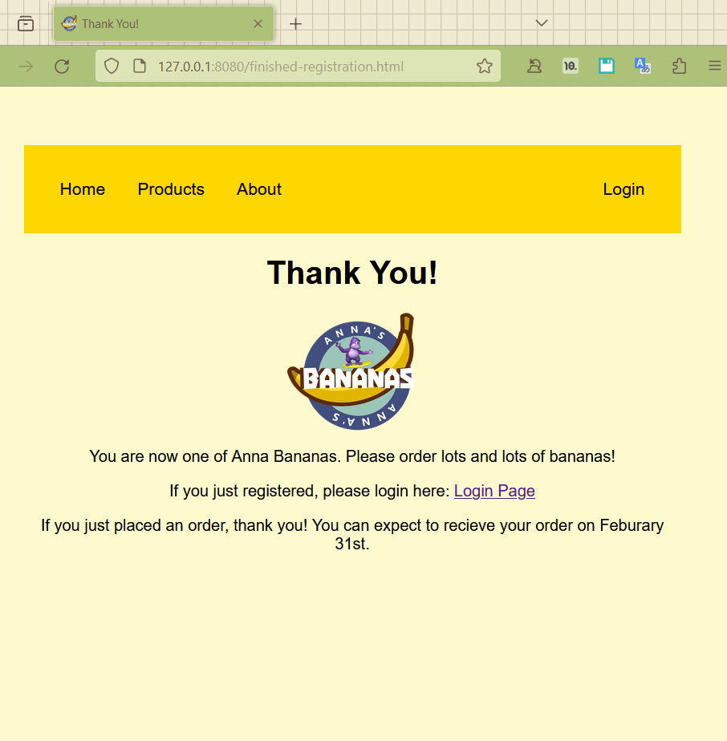

# Anna's Bananas eCommerce Site
## SE 450 Final Project
### Anna Andler | 11/15/2023

## Homepage
The below is the landing page when a user first navigates to the server.
From here, you can use the navigation bar to go to other tabs in the server

## About
The about page is an explaination of the company's origin and mission. 

## Login
Users can login to their existing account to access their cart and place orders. From here, a new user can follow the link to make a new account

## Register
A new user can create an account here. From here, they will be able to sign in.

## Products
The products page contains all of the products available for purchase. The products are dynamically displayed from the backend server. A signed-in user can add products to their cart.

## Cart
Once signed in, a user can add items to their cart and they will be displayed here. Once an item is added, they can "checkout" and place an order.

## Address
Once the checkout process has begun, a user will be prompted to enter the address to send the order to. Following this page, they will be redirected to the payment server to process their order payment.

## Payments
The payment server (accessible only on TCP 8081) is just a payment submission form that is "processed" and saved. 

## Success!
Once a user has been registered or an order has been placed, a thank you page is displayed

