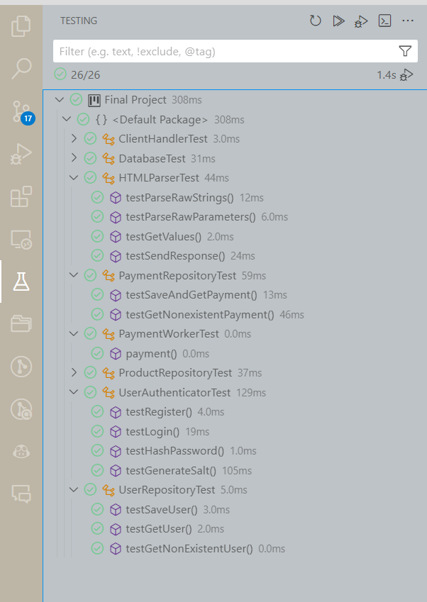

# Anna's Bananas eCommerce Site
## SE 450 Final Project
### Anna Andler | 11/15/2023

## Project Description
*"A simplified yet comprehensive shopping system. This system will allow customers to browse products, add items to their shopping cart, place orders, and even simulate the payment process."*

## Implementation
This project simulates an ecommerce site called "Anna's Bananas" and a seperate simulated "External Payment Vendor" Server that processes payments. 

I chose to do a web-based implementation with asyncronous multi-threading to process client requests. The front end is uses HTML, CSS, and JavaScript (as needed). The back end is written entirely in Java. 

Both sites are hosted locally, but on seperate ports. The ecommerce site is accessible on TCP port 8080. The payment server is accessible on TCP port 8081; however, the ecommerce site will auto redirect to/from the payment site as needed. 

Note: There is no need to start the payment server, as the ecommerce site auto starts the server thread upon program build. 

## UML Diagram

## Running the Server
> java BananaServer.java

## Accessing the Site
From a browser such as Firefox or Microsoft Edge, navigate to:
> http://localhost:8080

Note: I only tested the site from Firefox and Edge, so there may be issues with other browser clients. 

## Instructions for Use
The site can be used without any prior knowledge of how it works. Input and button clicks are sanitized and the users are notified if they did something wrong.

Note: the cart functionality is not available until the user has logged in.

## JUnit Tests
JUnit tests have been built out for critical program functions for the Database, PaymentRepository, ProductRepository, User Repository, User Authenticator, and HTML Parser classes. These tests use 'fake' databases that need to be deleted before/after each test.

## Acknolwedgements
Anna's Bananas is a fake company I made up a few years ago to build training exercises for my cybersecurity team.  I designed the logo myself; however, all other product images used in the site belong to their rightful owners. 

